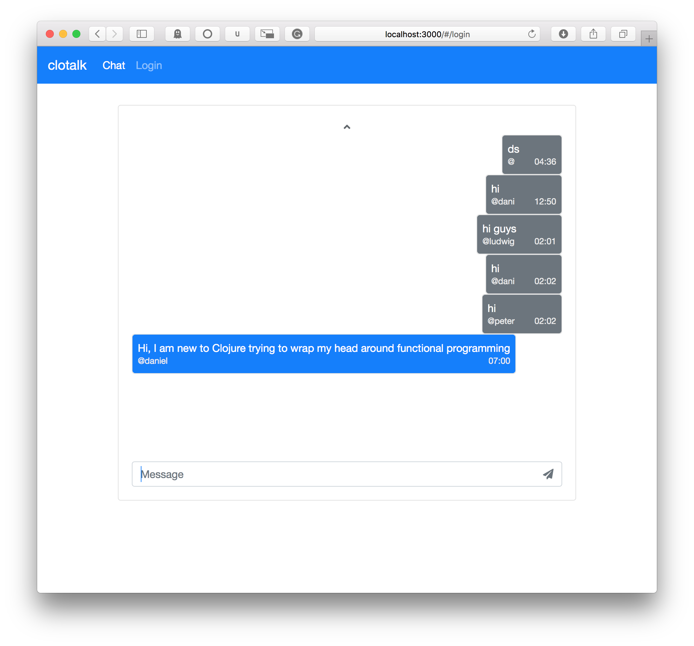

# clotalk

A simple websocket chat built with clojure + clojurescript and mongodb 
~~http://clotalk.herokuapp.com~~



## Prerequisites

You will need [Leiningen][1] 2.0 or above installed.

[1]: https://github.com/technomancy/leiningen	"Leiningen"
[2]: https://www.mongodb.com	"MongoDB"

## Running

1. Start mongodb

2. To start a web server for the application, run:

   ```
   lein run
   ```

3. open http://localhost:3000